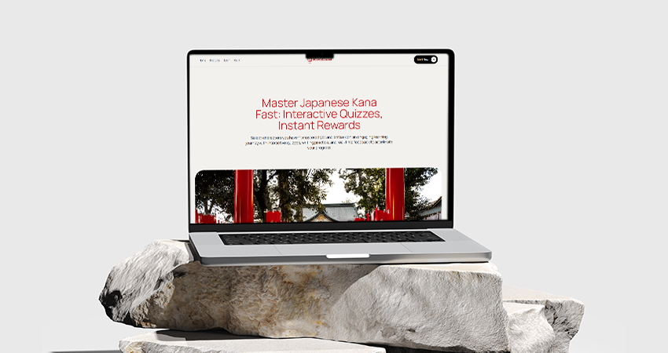

# KanaQuest

An interactive, full-stack journey to master the Japanese alphabets (Hiragana and Katakana) in a fun and effective way.

## 🎯 Project Goals

- **Gamified Learning:** Turn Kana study into a quiz game with points and difficulty levels.  
- **Instant Feedback:** Let users know immediately whether their answer is correct or not, with quick explanations.  
- **User Progress Tracking:** Keep stats on correct answers, mistakes, and response times to monitor improvement.  
- **Robust Backend:** Provide a scalable, API-driven backend to serve questions and record progress.

## 🚀 Live Demo

Check out the project in action:  
[Live Demo KanaQuest](kanaquest-tau.vercel.app)

## 🛠️ Technologies & Tools

- **Frontend:**  
  - **React** – Main library for declarative UI.  
  - **Vite** – Ultra-fast build and optimized dev environment.  
  - **React Router** – Navigation between screens (Quiz, Stats, About).
  - **GSAP (GreenSock Animation Platform)** – Library for creating advanced, high-performance animations.

- **Backend & APIs:**  
  - **Node.js + Express** – RESTful API server powering questions, user stats, and review data.  
  - **Supabase** – Hosted Postgres database and auth layer for persisting user progress.  
  - **LocalStorage Fallback** – Caches progress in the browser when offline.
